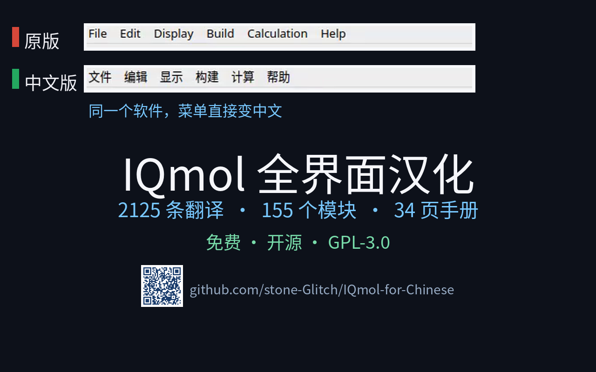

# IQmol3 简体中文版 · 汉化成果展示

> 开源分子编辑与可视化软件 IQmol3 的**全界面简体中文本地化**：菜单、对话框、提示信息全部改为简体中文，并附一份 34 页中文用户手册。
> 本页所有数字均可在仓库中逐条核对，不接受「据说」。


---

## 目录

- [数据卡（可核验）](#数据卡可核验)
- [宣传视频](#宣传视频)
- [下载](#下载)
- [界面一览（实机截图）](#界面一览实机截图)
- [为什么不是「机翻」](#为什么不是机翻)
- [数据怎么核验](#数据怎么核验)
- [快速开始](#快速开始)
- [相关链接](#相关链接)

---

## 数据卡（可核验）

| 指标 | 数值 | 说明 |
|---|---|---|
| 翻译条目 | **2125** | `translations/zh_CN.ts` 中已译 `<message>` 数 |
| 界面模块 | **155** | 覆盖的 `<context>`（菜单 / 对话框 / 面板）数 |
| 中文手册 | **34** | `doc/IQmolUserGuide.pdf` 页数 |
| 未译条目 | **0** | 全量完成，无 `unfinished` 残留 |

> 三个核心数字（2125 / 155 / 34）由 `scripts/video/verify_doc_numbers.py` 对仓库源码与 PDF 实测校验通过，与宣传视频、封面数据卡完全一致。

## 宣传视频



> 90 秒短视频，全部为本仓库构建版本的**实机录屏**（非静态截图拼接）：从主窗口到 Q-Chem 计算设置，再到频率振动动画，中英界面对照一目了然。
> 视频已在 B 站发布，链接见仓库置顶动态 / 简介。

## 下载

- **GitHub Releases（推荐）**：<https://github.com/stone-Glitch/IQmol-for-Chinese/releases>
  - Windows 成品包：`IQmol-win64-3.2.3-zh_CN.zip` / `.7z`
  - Linux 分发包：`IQmol-linux-x86_64.tar.gz`（解压后 `./run.sh` 即用）
- **中文用户手册（PDF）**：[`doc/IQmolUserGuide.pdf`](../../doc/IQmolUserGuide.pdf)（34 页，随包提供）

## 界面一览（实机截图）

中文界面下各对话框的运行时截图，存于 [`dialog_screenshots/`](../../dialog_screenshots/)：

| 关于 | 外观 | 相机 | 约束 |
|---|---|---|---|
|  |  |  |  |

更多：`InsertMolecule`、`IsotopeDialog` 等见截图目录。

## 为什么不是「机翻」

- **术语按领域规范处理**：如「弛豫密度」（非「松弛密度」）、「冻结核近似」等量子化学术语按规范统一。
- **保留快捷键与命令名**：熟练用户切到中文后手感不被打断。
- **一键切回英文**：偏好设置可在「中文 / English / 跟随系统」间切换（默认中文），便于与上游比对、排查误译。
- **覆盖全流程**：建模 → 计算 → 可视化全链路汉化。

> 说明：Q-Chem 对话框为独立第三方组件，其标题栏与部分菜单仍为英文，属上游固有，非汉化遗漏。

## 数据怎么核验

视频与简介里说的三个数字，都能在仓库里自己跑出来：

```bash
grep -c '<message'   translations/zh_CN.ts   # → 2125
grep -c '<context>'   translations/zh_CN.ts   # → 155
pdfinfo               doc/IQmolUserGuide.pdf  # → Pages: 34
```

## 快速开始

```bash
# 下载 Release 中的 Windows / Linux 包，解压即用
# Windows：解压后运行 IQmol.exe
# Linux：  解压后 ./run.sh
```

如需自行编译或更新翻译，参见：

- [构建与部署指南](构建与打包/构建与部署指南.md)
- [仓库结构](仓库结构.md)
- 翻译维护：`scripts/update_translations.sh`

## 相关链接

| 项 | 链接 |
|---|---|
| 本仓库 | <https://github.com/stone-Glitch/IQmol-for-Chinese> |
| 上游原版 | <https://github.com/nutjunkie/IQmol3> |
| 官方站点 | <http://iqmol.org> |
| 中文手册 | [`doc/IQmolUserGuide.pdf`](../../doc/IQmolUserGuide.pdf) |
| 构建 / 打包文档 | [`docs/构建与打包/`](构建与打包/) |
| 汉化工程文档 | [`docs/汉化工程/`](汉化工程/) |
| 问题反馈 | [CONTRIBUTING.md](../../CONTRIBUTING.md) ／ 仓库 Issue |

---

> 维护者：@stone-Glitch ｜ 最后更新：2026-10-03
